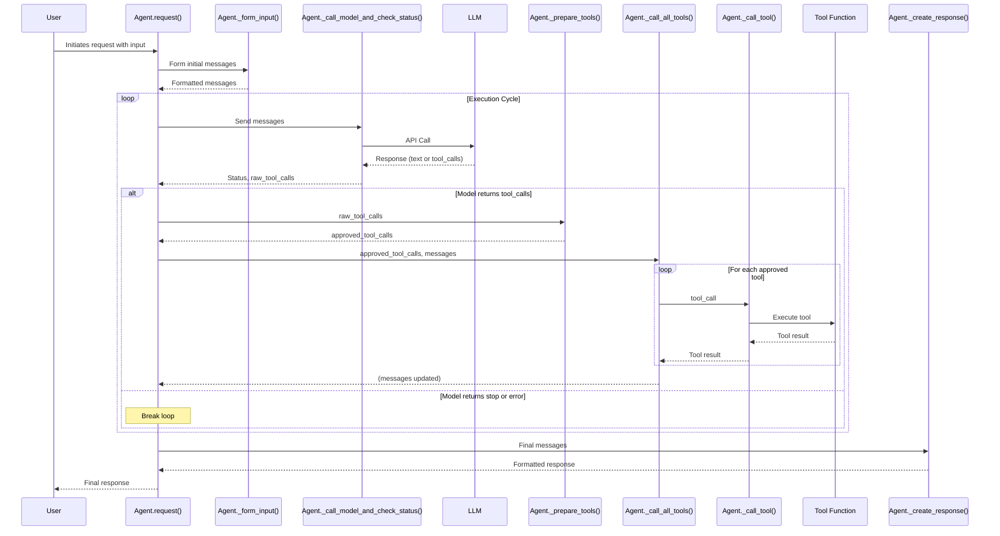
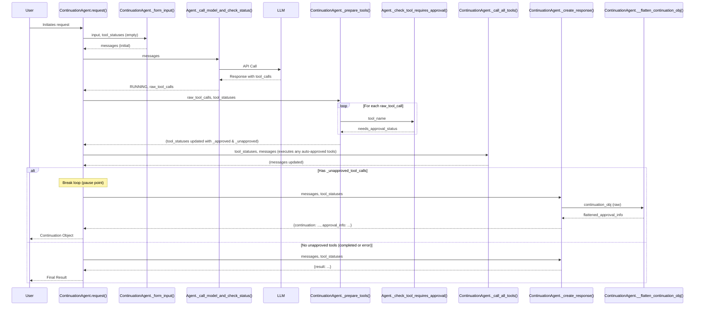
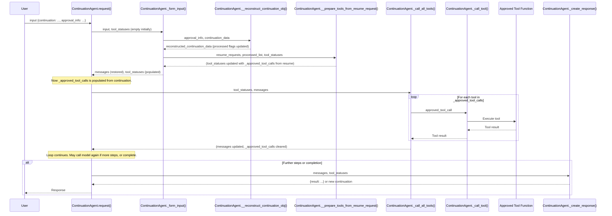
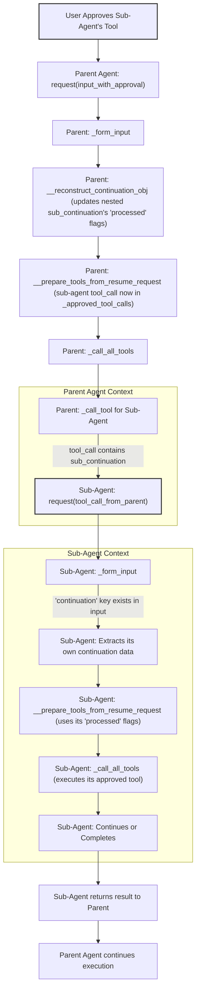

# Agent and ContinuationAgent Documentation

This document provides a detailed explanation of the `Agent` and `ContinuationAgent` classes found in `core/agent.py` and `core/continuation_agent.py` respectively.

## Table of Contents

1.  [Introduction](#introduction)
2.  [`Agent` Class (`agent.py`)](#agent-class-agentpy)
    *   [Purpose](#purpose)
    *   [Core Components](#core-components)
        *   [`__init__(instruction, tools)`](#__init__instruction-tools)
        *   [`request(input)`](#requestinput)
        *   [`as_tool(name, description, need_approval)`](#as_toolname-description-need_approval)
        *   [`_form_input(input)`](#_form_inputinput)
        *   [`_call_model_and_check_status(messages, model)`](#_call_model_and_check_statusmessages-model)
        *   [`_prepare_tools(uncategorized_tool_calls)`](#_prepare_toolsuncategorized_tool_calls)
        *   [`_call_all_tools(approved_tool_calls, messages)`](#_call_all_toolsapproved_tool_calls-messages)
        *   [`_call_tool(tool_call)`](#_call_tooltool_call)
        *   [`_create_response(messages)`](#_create_responsemessages)
        *   [`_check_tool_requires_approval(function_name)`](#_check_tool_requires_approvalfunction_name)
    *   [Basic Agent Request Flow Diagram](#basic-agent-request-flow-diagram)
3.  [`ContinuationAgent` Class (`continuation_agent.py`)](#continuationagent-class-continuation_agentpy)
    *   [Purpose and How Agent Continuations Work](#purpose-and-how-agent-continuations-work)
    *   [Key Overridden/New Methods](#key-overriddennew-methods)
        *   [`request(input)`](#requestinput-1)
        *   [`_form_input(input, tool_statuses)`](#_form_inputinput-tool_statuses)
        *   [`_prepare_tools(uncategorized_tool_calls, tool_statuses)`](#_prepare_toolsuncategorized_tool_calls-tool_statuses)
        *   [`_call_all_tools(tool_statuses, messages)`](#_call_all_toolstool_statuses-messages)
        *   [`_call_tool(tool_call)`](#_call_tooltool_call-1)
        *   [`_create_response(messages, tool_statuses)`](#_create_responsemessages-tool_statuses)
    *   [Static Helper Methods for Continuation Management](#static-helper-methods-for-continuation-management)
        *   [`__flatten_continuation_obj` & `__flatten_helper`](#__flatten_continuation_obj--__flatten_helper)
        *   [`__reconstruct_continuation_obj`, `__reconstruct_helper`, `__reconstruct_nested_helper`](#__reconstruct_continuation_obj-__reconstruct_helper-__reconstruct_nested_helper)
        *   [`__prepare_tools_from_resume_request`](#__prepare_tools_from_resume_request)
    *   [Flow Diagrams for ContinuationAgent](#flow-diagrams-for-continuationagent)
        *   [Agent Pausing for Approval](#agent-pausing-for-approval)
        *   [Agent Resuming from Continuation](#agent-resuming-from-continuation)
4.  [Handling Nested Continuations](#handling-nested-continuations)
    *   [Explanation](#explanation)
    *   [Flow Diagram for Nested Continuation](#flow-diagram-for-nested-continuation)
5.  [Scenario Walk-throughs](#scenario-walk-throughs)
    *   [Scenario 1: Simple Agent Execution (No Pausing)](#scenario-1-simple-agent-execution-no-pausing)
    *   [Scenario 2: Agent Pauses for Tool Approval](#scenario-2-agent-pauses-for-tool-approval)
    *   [Scenario 3: Agent Resumes After Tool Approval](#scenario-3-agent-resumes-after-tool-approval)
    *   [Scenario 4: Nested Continuation - Sub-agent Pauses](#scenario-4-nested-continuation---sub-agent-pauses)
    *   [Scenario 5: Nested Continuation - Resuming Sub-agent](#scenario-5-nested-continuation---resuming-sub-agent)

## Introduction

The provided Python code defines a base `Agent` class and a `ContinuationAgent` class that extends it. These classes form a framework for creating AI agents that can interact with language models, use tools, and, in the case of `ContinuationAgent`, support pausing and resuming execution, particularly for human-in-the-loop scenarios like tool approval.

The `ContinuationAgent` allows an agent's execution to be paused at arbitrary points, primarily when a tool call requires user approval. When paused, the agent's current state (messages, pending tool calls) is encapsulated in a "continuation" object. This object can be processed externally (e.g., by a UI for user approval), and then sent back to the agent's `request` method. The agent then resumes execution from the exact point it was paused, incorporating the approval decisions.

## `Agent` Class (`agent.py`)

The `Agent` class in [`agent.py`](1-human_in_the_loop/python_agents_v3/core/agent.py) provides the fundamental structure for an AI agent. It handles interactions with a language model (like OpenAI's GPT) and manages the execution of predefined tools.

### Purpose

The `Agent` class is designed to be a stateless entity that processes inputs, interacts with a language model, executes tools based on the model's suggestions, and returns a final result. Its statelessness is maintained by ensuring that all processing for a given request happens within the scope of the `request` method.

### Core Components

#### `__init__(instruction, tools)`

*   **File**: [`agent.py:19`](1-human_in_the_loop/python_agents_v3/core/agent.py:19)
*   **Description**: Initializes a new agent.
    *   `instruction` (str): The system prompt or initial instruction that guides the agent's behavior.
    *   `tools` (List[Callable]): A list of callable tool functions that the agent can use. These tools are expected to be decorated with the `@tool` decorator (from `core.tool`).
    *   It creates a `tool_map` for quick lookup of tools by their names.
    *   It initializes an `OpenAI` client for interacting with the language model.

#### `request(input)`

*   **File**: [`agent.py:37`](1-human_in_the_loop/python_agents_v3/core/agent.py:37)
*   **Description**: This is the main entry point for agent processing. It's designed to be stateless; all state for a single interaction is managed within this method's scope.
    1.  Calls [`_form_input(input)`](1-human_in_the_loop/python_agents_v3/core/agent.py:110) to format the initial messages for the model.
    2.  Enters a loop:
        *   Calls [`_call_model_and_check_status(messages)`](1-human_in_the_loop/python_agents_v3/core/agent.py:150) to get the model's response and any tool call requests.
        *   If the status is terminal (e.g., `COMPLETED`, `ERROR`), the loop breaks.
        *   Calls [`_prepare_tools(raw_tool_calls)`](1-human_in_the_loop/python_agents_v3/core/agent.py:92) to process the raw tool calls (in the base `Agent`, this is a simple pass-through).
        *   Calls [`_call_all_tools(approved_tool_calls, messages)`](1-human_in_the_loop/python_agents_v3/core/agent.py:100) to execute the tools and append their results to the messages.
    3.  Calls [`_create_response(messages)`](1-human_in_the_loop/python_agents_v3/core/agent.py:80) to formulate the final output.
*   **Returns**: A dictionary containing the agent's result and the message history.

#### `as_tool(name, description, need_approval)`

*   **File**: [`agent.py:51`](1-human_in_the_loop/python_agents_v3/core/agent.py:51)
*   **Description**: Allows an instance of an `Agent` (or its subclasses) to be wrapped and used as a tool by another agent.
    *   It takes a `name` and `description` for the tool representation.
    *   `need_approval` (bool): Specifies if this agent-tool requires approval when called.
    *   `is_agent` (bool, hardcoded to `True`): Marks this tool specifically as an agent.
    *   It uses the `@tool` decorator to wrap the agent's `request` method, making it conform to the tool interface.
*   **Returns**: A callable function that acts as a tool.

#### `_form_input(input)`

*   **File**: [`agent.py:110`](1-human_in_the_loop/python_agents_v3/core/agent.py:110)
*   **Description**: Prepares the initial list of messages to be sent to the language model.
    *   Requires an `input` dictionary with a `"prompt"` key.
    *   Constructs a list containing the system `instruction` (as a "developer" role message) and the user's `prompt` (as a "user" role message).
*   **Returns**: A list of message dictionaries.

#### `_call_model_and_check_status(messages, model)`

*   **File**: [`agent.py:150`](1-human_in_the_loop/python_agents_v3/core/agent.py:150)
*   **Description**: Interacts with the configured OpenAI language model.
    *   Sends the current `messages` and the list of available `tools` (formatted for OpenAI) to the model.
    *   Appends the model's response message (which might include tool calls) to the `messages` list.
    *   Determines the `AgentExecutionStatus` based on the model's `finish_reason`:
        *   `"stop"`: `AgentExecutionStatus.COMPLETED`.
        *   `"tool_calls"`: `AgentExecutionStatus.RUNNING`, and returns the list of tool calls.
        *   Other reasons: `AgentExecutionStatus.ERROR`.
*   **Returns**: A tuple `(AgentExecutionStatus, List[Dict[str, Any]])` representing the status and any raw tool calls.

#### `_prepare_tools(uncategorized_tool_calls)`

*   **File**: [`agent.py:92`](1-human_in_the_loop/python_agents_v3/core/agent.py:92)
*   **Description**: In the base `Agent` class, this method is a placeholder. It simply returns the list of `uncategorized_tool_calls` as is. Subclasses (like `ContinuationAgent`) override this to implement more complex logic, such as filtering tools based on approval requirements.
*   **Returns**: A list of tool call dictionaries.

#### `_call_all_tools(approved_tool_calls, messages)`

*   **File**: [`agent.py:100`](1-human_in_the_loop/python_agents_v3/core/agent.py:100)
*   **Description**: Executes a list of approved tool calls.
    *   Iterates through each `tool_call` in `approved_tool_calls`.
    *   Calls [`_call_tool(tool_call)`](1-human_in_the_loop/python_agents_v3/core/agent.py:126) to get the result of the tool execution.
    *   Appends the tool's result as a "tool" role message to the `messages` list.

#### `_call_tool(tool_call)`

*   **File**: [`agent.py:126`](1-human_in_the_loop/python_agents_v3/core/agent.py:126)
*   **Description**: Executes a single tool specified by `tool_call`.
    *   Extracts the function name and arguments from `tool_call`.
    *   Looks up the function in `self.tool_map`.
    *   If the tool is another agent (`func._tool.is_agent` is `True`), it calls the agent tool and expects a dictionary from which it extracts the `'result'`.
    *   Otherwise, it calls the regular tool function with the parsed arguments.
*   **Returns**: The result of the tool execution.
*   **Raises**: `ValueError` if the tool is not found.

#### `_create_response(messages)`

*   **File**: [`agent.py:80`](1-human_in_the_loop/python_agents_v3/core/agent.py:80)
*   **Description**: Creates the final response dictionary from the agent.
    *   In the base `Agent`, this typically includes the content of the last message in the `messages` list as the `"result"` and the full `messages` history.
*   **Returns**: A dictionary representing the agent's response.

#### `_check_tool_requires_approval(function_name)`

*   **File**: [`agent.py:176`](1-human_in_the_loop/python_agents_v3/core/agent.py:176)
*   **Description**: Checks if a given tool (by its `function_name`) requires approval before execution.
    *   Looks up the tool in `self.tool_map`.
    *   Returns the `need_approval` attribute of the tool's metadata (`_tool.need_approval`).
*   **Returns**: `True` if the tool requires approval, `False` otherwise.
*   **Raises**: `ValueError` if tools are not provided or the specific tool is not found.

### Basic Agent Request Flow Diagram



## `ContinuationAgent` Class (`continuation_agent.py`)

The `ContinuationAgent` class in [`continuation_agent.py`](1-human_in_the_loop/python_agents_v3/core/continuation_agent.py) extends the base `Agent` to add support for pausing and resuming execution. This is particularly useful for scenarios requiring human approval for certain tool calls.

### Purpose and How Agent Continuations Work

The primary purpose of `ContinuationAgent` is to enable an agent's execution to be suspended when a tool requires approval. When such a situation arises:

1.  The agent identifies that a tool suggested by the LLM needs approval.
2.  Instead of executing it directly, the agent packages its current state (including the history of messages and the list of unapproved tool calls) into a `continuation` object.
3.  This `continuation` object is returned to the caller.
4.  An external system (e.g., a user interface or another orchestrating agent) can then inspect this `continuation` object, present the unapproved tools for review, and gather approval decisions.
5.  Once decisions are made, the original `continuation` object, along with the approval information (`approval_info`), is sent back to the `ContinuationAgent`'s `request` method.
6.  The `ContinuationAgent` then reconstructs its state from the `continuation` object, processes the approvals, and resumes execution from where it left off, now executing the approved tools.

This mechanism allows for complex, multi-step agent interactions that can involve human oversight at critical junctures without losing the context of the ongoing task.

### Key Overridden/New Methods

#### `request(input)`

*   **File**: [`continuation_agent.py:9`](1-human_in_the_loop/python_agents_v3/core/continuation_agent.py:9)
*   **Description**: Overrides the base `Agent.request` method to manage continuations.
    1.  Initializes `tool_statuses` dictionary to track approved, unapproved, rejected, and uncategorized tool calls.
    2.  Calls its own [`_form_input(input, tool_statuses)`](1-human_in_the_loop/python_agents_v3/core/continuation_agent.py:86). If `input` contains a "continuation", this method restores the agent's state and populates `tool_statuses`.
    3.  Enters a `while True` loop:
        *   **If no tools are already approved for execution** (i.e., not resuming or previously approved tools are done):
            *   Calls [`_call_model_and_check_status(messages)`](1-human_in_the_loop/python_agents_v3/core/agent.py:150) (inherited from `Agent`).
            *   If status is terminal, breaks the loop.
            *   Calls its own [`_prepare_tools(raw_tool_calls, tool_statuses)`](1-human_in_the_loop/python_agents_v3/core/continuation_agent.py:53) to categorize tools based on approval needs.
        *   Calls its own [`_call_all_tools(tool_statuses, messages)`](1-human_in_the_loop/python_agents_v3/core/continuation_agent.py:59) to execute approved tools. This method also handles nested continuations if a tool (sub-agent) returns one.
        *   **If there are any unapproved or rejected tool calls**, the loop breaks. This is the pause point.
    4.  Calls its own [`_create_response(messages, tool_statuses)`](1-human_in_the_loop/python_agents_v3/core/continuation_agent.py:30) to generate the final output, which might be a result or a `continuation` object.

#### `_form_input(input, tool_statuses)`

*   **File**: [`continuation_agent.py:86`](1-human_in_the_loop/python_agents_v3/core/continuation_agent.py:86)
*   **Description**: Overrides `Agent._form_input`. Handles both initial requests and resumption from a continuation.
    *   **If `input` contains a `"continuation"` key**:
        *   Restores `messages` from `input["continuation"]["messages"]`.
        *   Retrieves `approval_info` from `input`.
        *   Calls [`ContinuationAgent.__reconstruct_continuation_obj()`](1-human_in_the_loop/python_agents_v3/core/continuation_agent.py:134) to update the `continuation` object with approval decisions from `approval_info`.
        *   Calls [`ContinuationAgent.__prepare_tools_from_resume_request()`](1-human_in_the_loop/python_agents_v3/core/continuation_agent.py:125) to populate `tool_statuses` (specifically `_approved_tool_calls` and `_rejected_tool_calls`) based on the reconstructed continuation.
    *   **Else (initial request)**:
        *   Calls `super()._form_input(input)` to get the initial messages.
*   **Returns**: The list of messages.

#### `_prepare_tools(uncategorized_tool_calls, tool_statuses)`

*   **File**: [`continuation_agent.py:53`](1-human_in_the_loop/python_agents_v3/core/continuation_agent.py:53)
*   **Description**: Overrides `Agent._prepare_tools`. Categorizes `uncategorized_tool_calls` from the LLM.
    *   Uses [`_check_tool_requires_approval(tool_name)`](1-human_in_the_loop/python_agents_v3/core/agent.py:176) (inherited) for each tool.
    *   Populates `tool_statuses["_approved_tool_calls"]` with tools that don't need approval.
    *   Populates `tool_statuses["_unapproved_tool_calls"]` with tools that *do* need approval.
    *   Clears `tool_statuses["_uncategorized_tool_calls"]`.

#### `_call_all_tools(tool_statuses, messages)`

*   **File**: [`continuation_agent.py:59`](1-human_in_the_loop/python_agents_v3/core/continuation_agent.py:59)
*   **Description**: Overrides `Agent._call_all_tools`. Executes tools from `tool_statuses["_approved_tool_calls"]`.
    *   For each `tool_call`:
        *   Calls its own [`_call_tool(tool_call)`](1-human_in_the_loop/python_agents_v3/core/continuation_agent.py:74), which returns the `result` and an `is_agent` flag.
        *   **If `is_agent` is `False`**: Appends the `result` to `messages`.
        *   **If `is_agent` is `True` and `result.get('continuation')` exists** (i.e., the sub-agent paused and returned its own continuation):
            *   The sub-agent's `continuation` is attached to the current `tool_call`.
            *   This `tool_call` (now containing the nested continuation) is moved to `tool_statuses["_unapproved_tool_calls"]`, effectively pausing the parent agent due to the sub-agent's pause.
        *   **If `is_agent` is `True` and no continuation**: Appends `result['result']` to `messages`.
    *   Clears `tool_statuses["_approved_tool_calls"]` after processing.

#### `_call_tool(tool_call)`

*   **File**: [`continuation_agent.py:74`](1-human_in_the_loop/python_agents_v3/core/continuation_agent.py:74)
*   **Description**: Overrides `Agent._call_tool`. Handles tool execution, especially for agent tools that might be resuming.
    *   Looks up the tool function (`func`).
    *   **If `func._tool.is_agent` is `True`**:
        *   **If `"continuation"` is in `tool_call`**: This means the sub-agent is being resumed. It calls `func(tool_call)` (passing the entire `tool_call` object which includes the sub-agent's specific continuation data).
        *   **Else (initial call to sub-agent)**: Calls `func(json.loads(function_params['arguments']))`.
        *   Returns `(result, True)`.
    *   **Else (regular tool)**: Calls `func(**json.loads(function_params['arguments']))`.
        *   Returns `(result, False)`.
*   **Returns**: A tuple `(Any, bool)` representing the tool's result and whether the tool was an agent.

#### `_create_response(messages, tool_statuses)`

*   **File**: [`continuation_agent.py:30`](1-human_in_the_loop/python_agents_v3/core/continuation_agent.py:30)
*   **Description**: Overrides `Agent._create_response`. Generates the agent's output, which could be a final result or a continuation object if paused.
    *   **If `tool_statuses["_unapproved_tool_calls"]` is not empty**:
        *   Creates a `continuation` dictionary containing:
            *   `messages`: Current message history.
            *   `resume_request`: The list of `_unapproved_tool_calls`.
            *   `processed`: An initial list marking these tools as not yet approved.
        *   Calls [`ContinuationAgent.__flatten_continuation_obj()`](1-human_in_the_loop/python_agents_v3/core/continuation_agent.py:119) to create a flattened list of tool calls needing approval (`approval_info`), which is easier for UIs or external systems to process.
        *   Returns `{"continuation": continuation, "approval_info": approval_info}`.
    *   **Else if `tool_statuses["_rejected_tool_calls"]` is not empty**:
        *   Returns `{"messages": messages, "rejected_tool_calls": ...}`.
    *   **Else (execution completed without pausing or all approved tools ran)**:
        *   Returns `{"result": messages[-1]['content'], "messages": messages}`.

### Static Helper Methods for Continuation Management

These `staticmethod`s are internal to `ContinuationAgent` and manage the structure of continuation objects, especially for nested scenarios.

#### `__flatten_continuation_obj` & `__flatten_helper`

*   **File**: [`continuation_agent.py:119`](1-human_in_the_loop/python_agents_v3/core/continuation_agent.py:119) (for `__flatten_continuation_obj`) and [`continuation_agent.py:100`](1-human_in_the_loop/python_agents_v3/core/continuation_agent.py:100) (for `__flatten_helper`)
*   **Purpose**: To take a potentially nested `continuation` object (where a sub-agent might have its own `resume_request`) and create a single, flat list of all tool calls that require approval.
*   **How it works**:
    *   `__flatten_helper` recursively traverses the `resume_request` list within a continuation object.
    *   If a `resume_request` item itself has a `continuation` (meaning it's a paused sub-agent), it recurses into that.
    *   Otherwise, it appends an object to `flattened_list` containing:
        *   `paths`: A list of tool function names showing the call stack to this specific tool.
        *   `path_ids`: A list of tool call IDs for the path.
        *   `tool_call`: The actual tool call object needing approval.
        *   `approved`: Initialized to `False`.
    *   `__flatten_continuation_obj` initializes the process and returns the `flattened_result`.
*   **Use Case**: The `approval_info` returned by `_create_response` uses this flattened list, making it easier for an external system to display all pending approvals without needing to parse a complex nested structure.

#### `__reconstruct_continuation_obj`, `__reconstruct_helper`, `__reconstruct_nested_helper`

*   **File**: [`continuation_agent.py:134`](1-human_in_the_loop/python_agents_v3/core/continuation_agent.py:134), [`continuation_agent.py:142`](1-human_in_the_loop/python_agents_v3/core/continuation_agent.py:142), [`continuation_agent.py:147`](1-human_in_the_loop/python_agents_v3/core/continuation_agent.py:147)
*   **Purpose**: To take the `approval_info` (the flattened list, now presumably updated with user approval decisions) and update the original (potentially nested) `continuation` object's `processed` flags.
*   **How it works**:
    *   `__reconstruct_continuation_obj` iterates through each item in `approval_info`.
    *   `__reconstruct_helper` initiates the nested update for a single approved/rejected item from `approval_info`.
    *   `__reconstruct_nested_helper` recursively navigates the `continuation` object using `path_ids` from the `approval_obj`. At each level, it finds the corresponding `resume_request` item and updates its `processed` list to reflect the approval status. If it's not the final tool in the path, it also sets intermediate `processed` items to `True` (implicitly approved because a deeper tool is being actioned) unless the final decision is a rejection for the specific tool at the end of the path.
*   **Use Case**: This is called by `_form_input` when resuming. It ensures that when the agent continues, the `processed` lists within the `continuation` structure accurately reflect which tools were approved or rejected, allowing `__prepare_tools_from_resume_request` to correctly sort them.

#### `__prepare_tools_from_resume_request`

*   **File**: [`continuation_agent.py:125`](1-human_in_the_loop/python_agents_v3/core/continuation_agent.py:125)
*   **Purpose**: After the `continuation` object has been updated with approval decisions (by `__reconstruct_continuation_obj`), this method populates the `tool_statuses` dictionary for the current execution cycle.
*   **How it works**:
    *   It takes the `resume_requests` (from the continuation object) and the `processed_list` (also from the continuation object, now updated with approvals).
    *   It iterates through `resume_requests` and, based on the `approved` status in the corresponding `processed_list` item, adds the request to either `tool_statuses['_approved_tool_calls']` or `tool_statuses['_rejected_tool_calls']`.
    *   Includes a validation check to ensure all requests are either approved or rejected.
*   **Use Case**: Called by `_form_input` during resumption to set up the `tool_statuses` so that the main loop in `request` can proceed to execute the approved tools or handle rejected ones.

### Flow Diagrams for `ContinuationAgent`

#### Agent Pausing for Approval



#### Agent Resuming from Continuation



## Handling Nested Continuations

A powerful feature of this system is its ability to handle nested continuations. This occurs when an agent (the "parent" agent) calls another `ContinuationAgent` (the "sub-agent") as one of its tools, and that sub-agent itself needs to pause for an approval.

### Explanation

**Question**: *If a continuation object has a nested continuation because the agent was paused by a tool call approval in a sub-agent, then the tool call is approved and the continuation object is sent back to the top-level agent through the request method, will the request method of the sub-agent eventually be called with the nested continuation object to resume the approved tool call? If so, can you explain how this works?*

**Answer**: Yes, the sub-agent's `request` method will eventually be called with its specific nested continuation object to resume its approved tool call. Here's the detailed flow:

1.  **Sub-agent Pauses**:
    *   The parent `ContinuationAgent` calls a sub-agent (which is also a `ContinuationAgent`) as a tool.
    *   The sub-agent executes its `request` method. During its execution, it determines that one of *its* tools requires approval.
    *   The sub-agent's `_create_response` method generates its *own* `continuation` object (let's call this `sub_continuation`).
    *   The sub-agent's `request` method returns this `sub_continuation` (typically wrapped, e.g., `{'continuation': sub_continuation, ...}`).

2.  **Parent Agent Handles Sub-agent's Pause**:
    *   The parent agent is in its `_call_all_tools` method, processing the call to the sub-agent.
    *   It receives the result from the sub-agent, which includes `sub_continuation`.
    *   The parent agent's `_call_all_tools` (specifically lines 66-68 in [`continuation_agent.py`](1-human_in_the_loop/python_agents_v3/core/continuation_agent.py:66)) detects this: `elif result.get('continuation'):`.
    *   It attaches `sub_continuation` to the parent's `tool_call` object for the sub-agent: `tool_call['continuation'] = result['continuation']`.
    *   This modified `tool_call` (now containing the nested `sub_continuation`) is then added to the parent agent's `_unapproved_tool_calls` list.
    *   The parent agent's main loop in `request` then breaks because it has an unapproved tool call (the sub-agent that needs to resume).
    *   The parent agent's `_create_response` generates its *own* `continuation` object. This parent continuation will have the sub-agent's `tool_call` (with the nested `sub_continuation`) in its `resume_request`. The `__flatten_continuation_obj` method will ensure this nested approval is represented in the `approval_info`.

3.  **Approval and Resumption of Parent Agent**:
    *   The parent `continuation` object (with `approval_info` reflecting the need to approve the sub-agent's specific tool) is sent back to the parent agent's `request` method, after external approval.
    *   The parent agent's `_form_input` calls `__reconstruct_continuation_obj`. This method updates the `processed` flags throughout the entire nested structure, including within `sub_continuation`, based on the `approval_info`.
    *   `__prepare_tools_from_resume_request` then populates the parent agent's `_approved_tool_calls`. The `tool_call` for the sub-agent (still containing the reconstructed `sub_continuation`) will now be in this list.

4.  **Parent Agent Re-invokes Sub-agent with Nested Continuation**:
    *   The parent agent's `_call_all_tools` iterates through its `_approved_tool_calls`.
    *   When it gets to the `tool_call` for the sub-agent, it calls its `_call_tool` method.
    *   Inside the parent's `_call_tool` ([`continuation_agent.py:79`](1-human_in_the_loop/python_agents_v3/core/continuation_agent.py:79)):
        *   It checks `if func._tool.is_agent:` (True).
        *   Crucially, it checks `if "continuation" in tool_call:`. This is now **True** because `sub_continuation` was attached in step 2.
        *   It then executes `return func(tool_call), True`. `func` is the sub-agent's `request` method. The sub-agent is called with the *entire `tool_call` object from the parent*, which includes the `tool_call['continuation']` (i.e., `sub_continuation`).

5.  **Sub-agent Resumes**:
    *   The sub-agent's `request` method is now called. Its `input` argument is the `tool_call` object passed by the parent.
    *   The sub-agent's `_form_input` method is called.
    *   It checks `if "continuation" in input:` ([`continuation_agent.py:88`](1-human_in_the_loop/python_agents_v3/core/continuation_agent.py:88)). This is **True** because `input['continuation']` is `sub_continuation`.
    *   The sub-agent then extracts `messages = input["continuation"]["messages"]`, `approval_info = input.get("approval_info", [])` (this `approval_info` at the sub-agent level might be less relevant if reconstruction already handled its part at the top level, but the key is the `processed` flags within its `input["continuation"]`), and its specific `continuation = input["continuation"]`.
    *   Its `__prepare_tools_from_resume_request` uses its `resume_request` and the (already updated by parent's reconstruction) `processed` list from `sub_continuation` to populate its own `_approved_tool_calls`.
    *   The sub-agent now proceeds with its execution loop, ready to execute its tool that was originally pending approval.

This careful passing and reconstruction of nested continuation objects ensures that the correct state is restored at each level of the agent hierarchy.

### Flow Diagram for Nested Continuation



## Scenario Walk-throughs

### Scenario 1: Simple Agent Execution (No Pausing)

1.  **Input**: User provides a prompt to a basic `Agent` (or a `ContinuationAgent` where no tools require approval).
    *   Example: `input = {"prompt": "What is the capital of France?"}`
2.  **`Agent.request(input)` starts**:
    *   `_form_input` creates messages: `[{"role": "developer", "content": "...instruction..."}, {"role": "user", "content": "What is the capital of France?"}]`.
3.  **Loop 1**:
    *   `_call_model_and_check_status`: Sends messages to LLM.
    *   LLM responds directly (no tool needed): `{"role": "assistant", "content": "The capital of France is Paris."}`, `finish_reason: "stop"`.
    *   Status becomes `AgentExecutionStatus.COMPLETED`. `raw_tool_calls` is empty.
    *   Loop breaks because status is terminal.
4.  **`_create_response`**:
    *   Returns `{"result": "The capital of France is Paris.", "messages": [...]}`.
5.  **Output**: Agent returns the direct answer.

*If a tool was needed and didn't require approval:*
3.  **Loop 1 (modified)**:
    *   `_call_model_and_check_status`: LLM returns `tool_calls = [{"id": "call_123", "function": {"name": "search_web", "arguments": '{"query": "capital of France"}'}}]`, `finish_reason: "tool_calls"`. Status is `RUNNING`.
    *   `_prepare_tools` (base `Agent`): `approved_tool_calls` is same as `raw_tool_calls`.
        *   (For `ContinuationAgent`, if `search_web` doesn't need approval, it goes to `_approved_tool_calls`).
    *   `_call_all_tools`:
        *   `_call_tool` for `search_web`. `search_web` executes and returns "Paris is the capital."
        *   Tool result message `{"role": "tool", "tool_call_id": "call_123", "content": "Paris is the capital."}` is appended to messages.
4.  **Loop 2**:
    *   `_call_model_and_check_status`: Sends updated messages (including tool result) to LLM.
    *   LLM responds: `{"role": "assistant", "content": "The capital of France is Paris."}`, `finish_reason: "stop"`.
    *   Status becomes `AgentExecutionStatus.COMPLETED`.
    *   Loop breaks.
5.  **`_create_response`**: Returns final answer.

### Scenario 2: `ContinuationAgent` Pauses for Tool Approval

1.  **Input**: User provides a prompt to `ContinuationAgent`. A tool `deploy_code` requires approval.
    *   `input = {"prompt": "Deploy the latest changes to production."}`
2.  **`ContinuationAgent.request(input)` starts**:
    *   `_form_input` (initial): Creates initial messages. `tool_statuses` is empty.
3.  **Loop 1**:
    *   `_call_model_and_check_status`: LLM suggests `tool_calls = [{"id": "call_abc", "function": {"name": "deploy_code", "arguments": '{"environment": "production"}'}}]`. Status `RUNNING`.
    *   `_prepare_tools(raw_tool_calls, tool_statuses)`:
        *   `_check_tool_requires_approval("deploy_code")` returns `True`.
        *   `tool_statuses["_unapproved_tool_calls"]` becomes `[{"id": "call_abc", ...}]`.
        *   `tool_statuses["_approved_tool_calls"]` remains empty.
    *   `_call_all_tools(tool_statuses, messages)`: `_approved_tool_calls` is empty, so nothing happens here.
    *   Loop condition `tool_statuses["_unapproved_tool_calls"] or tool_statuses["_rejected_tool_calls"]` is now `True`. Loop breaks.
4.  **`_create_response(messages, tool_statuses)`**:
    *   Condition `if tool_statuses["_unapproved_tool_calls"]:` is `True`.
    *   `continuation` object is created:
        ```json
        {
          "messages": [...], // current history
          "resume_request": [{"id": "call_abc", "function": {"name": "deploy_code", ...}}],
          "processed": [{"id": "call_abc", "approved": false}]
        }
        ```
    *   `__flatten_continuation_obj` is called to generate `approval_info`:
        ```json
        [{
          "paths": ["deploy_code"],
          "path_ids": ["call_abc"],
          "tool_call": {"id": "call_abc", ...},
          "approved": false
        }]
        ```
    *   Returns `{"continuation": ..., "approval_info": ...}`.
5.  **Output**: Agent returns the continuation object, pausing execution.

### Scenario 3: `ContinuationAgent` Resumes After Tool Approval

1.  **Input**: User (or system) provides the continuation from Scenario 2, with approval.
    ```json
    // Simplified input
    {
      "continuation": { // The continuation object from Scenario 2
        "messages": [...],
        "resume_request": [{"id": "call_abc", "function": {"name": "deploy_code", ...}}],
        "processed": [{"id": "call_abc", "approved": false}] // Original processed
      },
      "approval_info": [{ // User has approved this
        "paths": ["deploy_code"],
        "path_ids": ["call_abc"],
        "tool_call": {"id": "call_abc", ...},
        "approved": true // Key change: user approved
      }]
    }
    ```
2.  **`ContinuationAgent.request(input)` starts**:
    *   `_form_input(input, tool_statuses)`:
        *   `"continuation"` key is present.
        *   `messages` are restored from `input["continuation"]["messages"]`.
        *   `__reconstruct_continuation_obj(approval_info, input["continuation"])` is called. This updates `input["continuation"]["processed"]` to `[{"id": "call_abc", "approved": true}]`.
        *   `__prepare_tools_from_resume_request(...)` is called.
            *   `tool_statuses["_approved_tool_calls"]` becomes `[{"id": "call_abc", ...}]`.
            *   `tool_statuses["_rejected_tool_calls"]` is empty.
            *   `tool_statuses["_unapproved_tool_calls"]` is empty.
3.  **Loop 1**:
    *   `if not tool_statuses["_approved_tool_calls"]:` is `False` (it has the `deploy_code` call).
    *   `_call_all_tools(tool_statuses, messages)`:
        *   Iterates `_approved_tool_calls`.
        *   `_call_tool({"id": "call_abc", ...})` is invoked.
            *   `deploy_code` function executes, returns "Deployment successful."
        *   Tool result message `{"role": "tool", "tool_call_id": "call_abc", "content": "Deployment successful."}` is appended to `messages`.
        *   `tool_statuses["_approved_tool_calls"]` is cleared.
    *   Loop condition `tool_statuses["_unapproved_tool_calls"] or tool_statuses["_rejected_tool_calls"]` is `False`. Loop continues.
4.  **Loop 1 (continues, now `_approved_tool_calls` is empty)**:
    *   `if not tool_statuses["_approved_tool_calls"]:` is `True`.
    *   `_call_model_and_check_status(messages)`: Sends messages (including deployment result) to LLM.
    *   LLM responds: `{"role": "assistant", "content": "The deployment was successful."}`, `finish_reason: "stop"`.
    *   Status becomes `AgentExecutionStatus.COMPLETED`.
    *   Loop breaks.
5.  **`_create_response(messages, tool_statuses)`**:
    *   No unapproved or rejected calls.
    *   Returns `{"result": "The deployment was successful.", "messages": [...]}`.
6.  **Output**: Agent returns the final result after resuming and completing.

### Scenario 4: Nested Continuation - Sub-agent Pauses

1.  **Setup**:
    *   `ParentAgent` (a `ContinuationAgent`) has a tool `run_analysis_pipeline`.
    *   `run_analysis_pipeline` is actually `SubAgent.as_tool(...)` (another `ContinuationAgent`).
    *   `SubAgent` has a tool `fetch_sensitive_data` which requires approval.
2.  **ParentAgent Execution**:
    *   `ParentAgent.request({"prompt": "Analyze critical data."})`.
    *   LLM (for ParentAgent) suggests calling `run_analysis_pipeline`. This tool itself does not require approval at the ParentAgent level.
    *   `ParentAgent._call_all_tools` calls `ParentAgent._call_tool` for `run_analysis_pipeline`.
    *   This invokes `SubAgent.request(...)` with arguments from ParentAgent.
3.  **SubAgent Execution**:
    *   `SubAgent.request` starts.
    *   LLM (for SubAgent) suggests calling `fetch_sensitive_data`.
    *   `SubAgent._prepare_tools` identifies `fetch_sensitive_data` needs approval. `SubAgent.tool_statuses["_unapproved_tool_calls"]` gets this tool call.
    *   `SubAgent` loop breaks.
    *   `SubAgent._create_response` generates `sub_continuation = {"messages": ..., "resume_request": [fetch_sensitive_data_call], ...}` and `sub_approval_info`.
    *   `SubAgent.request` returns `{"continuation": sub_continuation, "approval_info": sub_approval_info}` to `ParentAgent._call_tool`.
4.  **ParentAgent Handles SubAgent's Pause**:
    *   `ParentAgent._call_tool` receives the dictionary containing `sub_continuation`.
    *   It returns this (and `is_agent=True`) to `ParentAgent._call_all_tools`.
    *   `ParentAgent._call_all_tools` (lines 66-68):
        *   `result.get('continuation')` is `True` (it's `sub_continuation`).
        *   `tool_call_for_sub_agent['continuation'] = sub_continuation`.
        *   `tool_call_for_sub_agent` is added to `ParentAgent.tool_statuses["_unapproved_tool_calls"]`.
    *   `ParentAgent` loop breaks.
    *   `ParentAgent._create_response` generates `parent_continuation`.
        *   `parent_continuation["resume_request"]` will contain `tool_call_for_sub_agent` (which itself has `['continuation']` pointing to `sub_continuation`).
        *   `parent_approval_info` (flattened) will list the `fetch_sensitive_data` tool, with a path like `["run_analysis_pipeline", "fetch_sensitive_data"]`.
5.  **Output**: `ParentAgent` returns `parent_continuation` (containing the nested `sub_continuation`).
    *   The `parent_continuation` object, before being fully processed by `_create_response` for `approval_info` generation, conceptually holds the nested structure. Its `resume_request` would point to the sub-agent's tool call, which itself contains the `sub_continuation`:
        ```json
        // Simplified parent_continuation (conceptual structure)
        {
          "messages": "[...]", // ParentAgent's current message history
          "resume_request": [
            { // Tool call for the SubAgent (e.g., run_analysis_pipeline)
              "id": "call_parent_tool_xyz",
              "function": {"name": "run_analysis_pipeline", "arguments": "{...}"},
              // This 'continuation' field is key for nesting. It holds sub_continuation.
              "continuation": {
                "messages": "[...]", // SubAgent's message history at its pause point
                "resume_request": [
                  { // Tool call within SubAgent that needs approval
                    "id": "call_sub_tool_abc",
                    "function": {"name": "fetch_sensitive_data", "arguments": "{...}"}
                  }
                ],
                "processed": [{"id": "call_sub_tool_abc", "approved": false}] // SubAgent's view of its tool
              }
            }
          ],
          // ParentAgent also has a 'processed' list for its direct resume_request items.
          "processed": [{"id": "call_parent_tool_xyz", "approved": false}]
        }
        ```
    *   The `approval_info` generated by `ParentAgent._create_response` (using `__flatten_continuation_obj`) would then present a flattened view for external approval:
        ```json
        // Simplified parent_approval_info (flattened for UI/external system)
        [{
          "paths": ["run_analysis_pipeline", "fetch_sensitive_data"], // Path to the actual tool needing approval
          "path_ids": ["call_parent_tool_xyz", "call_sub_tool_abc"],
          "tool_call": {"id": "call_sub_tool_abc", "function": {"name": "fetch_sensitive_data", "arguments": "{...}"}, ...},
          "approved": false
        }]
        ```

### Scenario 5: Nested Continuation - Resuming Sub-agent

1.  **Input**: `ParentAgent.request` is called with `parent_continuation` from Scenario 4, and `approval_info` indicating `fetch_sensitive_data` (via its path) is approved.
    *   The simplified input structure sent to `ParentAgent.request` would be:
        ```json
        // Simplified input to ParentAgent.request for resuming nested continuation
        {
          "continuation": { // This is parent_continuation from Scenario 4 output
            "messages": "[...]", // ParentAgent's messages
            "resume_request": [
              {
                "id": "call_parent_tool_xyz", // Tool call for SubAgent
                "function": {"name": "run_analysis_pipeline", "arguments": "{...}"},
                "continuation": { // This is sub_continuation, carried over
                  "messages": "[...]", // SubAgent's messages
                  "resume_request": [
                    {
                      "id": "call_sub_tool_abc", // SubAgent's tool
                      "function": {"name": "fetch_sensitive_data", "arguments": "{...}"}
                    }
                  ],
                  // 'processed' here is from sub_continuation's original state.
                  // It will be updated by ParentAgent.__reconstruct_continuation_obj
                  // based on the top-level approval_info.
                  "processed": [{"id": "call_sub_tool_abc", "approved": false}]
                }
              }
            ],
            // 'processed' for parent_continuation's resume_request. Also to be updated.
            "processed": [{"id": "call_parent_tool_xyz", "approved": false}]
          },
          "approval_info": [{ // User has approved the nested tool via the flattened path
            "paths": ["run_analysis_pipeline", "fetch_sensitive_data"],
            "path_ids": ["call_parent_tool_xyz", "call_sub_tool_abc"],
            "tool_call": {"id": "call_sub_tool_abc", "function": {"name": "fetch_sensitive_data", "arguments": "{...}"}, ...},
            "approved": true // Key change: user approved this specific tool
          }]
        }
        ```
2.  **ParentAgent Resumes**:
    *   `ParentAgent._form_input`:
        *   `__reconstruct_continuation_obj` updates `processed` flags in both `parent_continuation` and the nested `sub_continuation`. The `processed` entry for `fetch_sensitive_data` within `sub_continuation` is now marked `approved: true`.
        *   `__prepare_tools_from_resume_request` puts `tool_call_for_sub_agent` (still containing the updated `sub_continuation`) into `ParentAgent.tool_statuses["_approved_tool_calls"]`.
3.  **ParentAgent Calls SubAgent with Continuation**:
    *   `ParentAgent._call_all_tools` iterates.
    *   `ParentAgent._call_tool` is called for `tool_call_for_sub_agent`.
        *   `if "continuation" in tool_call_for_sub_agent:` is `True` (it's `sub_continuation`).
        *   `SubAgent.request(tool_call_for_sub_agent)` is invoked. The argument passed is the `tool_call` object from the parent, which includes `['continuation']` being the `sub_continuation`.
4.  **SubAgent Resumes**:
    *   `SubAgent.request(input_is_tool_call_from_parent)` starts.
    *   `SubAgent._form_input`:
        *   `if "continuation" in input_is_tool_call_from_parent:` is `True`.
        *   It extracts `messages` and `continuation_data` from `input_is_tool_call_from_parent["continuation"]` (which is `sub_continuation`).
        *   `__prepare_tools_from_resume_request` (for SubAgent) uses `sub_continuation.resume_request` and `sub_continuation.processed`. `fetch_sensitive_data_call` is added to `SubAgent.tool_statuses["_approved_tool_calls"]`.
5.  **SubAgent Executes Approved Tool**:
    *   `SubAgent._call_all_tools` executes `fetch_sensitive_data`.
    *   `SubAgent` continues its execution (e.g., calls LLM with data, completes).
    *   `SubAgent._create_response` returns a final result (e.g., `{"result": "Analysis complete.", ...}`).
    *   `SubAgent.request` returns this result to `ParentAgent._call_tool`.
6.  **ParentAgent Continues**:
    *   `ParentAgent._call_tool` receives the final result from `SubAgent`.
    *   `ParentAgent._call_all_tools` appends this result to `ParentAgent.messages`.
    *   `ParentAgent` continues its execution (e.g., calls LLM with analysis result, completes).
